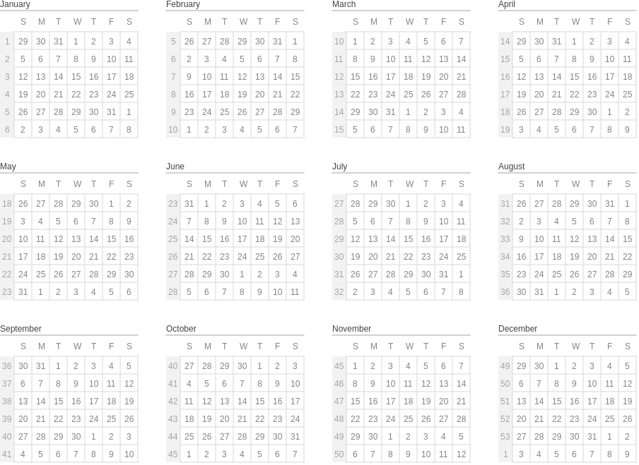

# P5 Calendar

Calendar made wtih p5.js  
It supports also dark template or you can easily create your own color template inside of chart-color.ts

This project was generated with [Angular CLI](https://github.com/angular/angular-cli) version 7.3.0.

## Development server

Run `ng serve` for a dev server. Navigate to `http://localhost:4200/`. The app will automatically reload if you change any of the source files.

## Build

Run `ng build` to build the project. The build artifacts will be stored in the `dist/` directory. Use the `--prod` flag for a production build.
